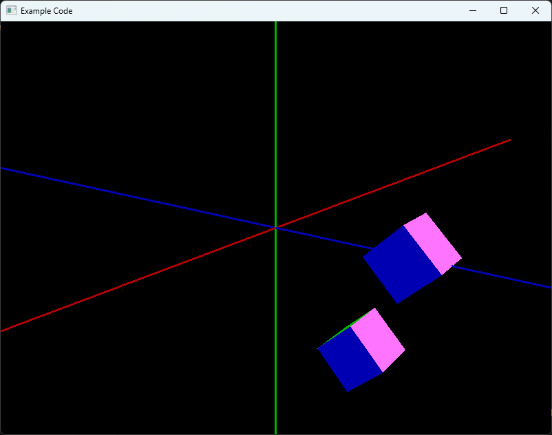

# Computer Graphics
This is the base code for assignments in the SKKU Computer Graphics Course.

## Installation
### PyOpenGL
You can install PyOpenGL using the following command:

    $ pip install PyOpenGL PyOpenGL_accelerate

If you encounter any issues during installation, it is recommended to install it manually by cloning the repository and installing it locally.

To download the code:

    $ git clone https://github.com/mcfletch/pyopengl.git

To install PyOpenGL manually:

    $ cd pyopengl
    $ pip install -e .
    $ cd accelerate
    $ pip install -e .

### PyGLM
You can install PyGLM from PyPI using pip:

    $ pip install PyGLM

## Execution
You can run the sample code using the following command:

    $ python main.py

You can then see the result, as shown in the image below.

